# AI Data Migration Platform — Database Schema Documentation

This document serves as the authoritative, central specification of the **Control Plane Database Schema** for the AI Data Migration Platform API (`apps/api`). 

---

## Table of Contents

1. [Architecture Overview](#1-architecture-overview)
2. [Entity Relationship (ER) Diagram](#2-entity-relationship-er-diagram)
3. [Domain Models & Table Specifications](#3-domain-models--table-specifications)
   - [User Management Domain](#31-user-management-domain)
     - [`users`](#311-users)
   - [Agent Control & Connectivity Domain](#32-agent-control--connectivity-domain)
     - [`agents`](#321-agents)
     - [`data_sources`](#322-data_sources)
   - [Metadata & Schema Profiling Domain](#33-metadata--schema-profiling-domain)
     - [`metadata_snapshots`](#331-metadata_snapshots)
     - [`metadata_schemas`](#332-metadata_schemas)
     - [`metadata_tables`](#333-metadata_tables)
     - [`metadata_columns`](#334-metadata_columns)
     - [`metadata_constraints`](#335-metadata_constraints)
     - [`metadata_relationships`](#336-metadata_relationships)
   - [Migration Planning Domain](#34-migration-planning-domain)
     - [`migration_plans`](#341-migration_plans)
     - [`migration_plan_snapshots`](#342-migration_plan_snapshots)
   - [Execution & Monitoring Domain](#35-execution--monitoring-domain)
     - [`migration_jobs`](#351-migration_jobs)
     - [`migration_errors`](#352-migration_errors)
4. [Summary of Foreign Key Constraints](#4-summary-of-foreign-key-constraints)
5. [Summary of Indexes & Unique Constraints](#5-summary-of-indexes--unique-constraints)

---

## 1. Architecture Overview

The database is built on **PostgreSQL** using **SQLAlchemy 2.0 (Async)** and **Alembic** for schema migrations.

- **Primary Keys**: All primary keys are 128-bit `UUIDv4` identifiers (`uuid_generate_v4()` / `uuid.uuid4()`).
- **Timestamps**: All temporal columns use `TIMESTAMPTZ` (`DateTime(timezone=True)`).
- **Extensibility**: Complex structured metrics and metadata profiles are stored using native PostgreSQL `JSONB`.
- **Soft Deletes vs Cascades**: Core parent entities (`users`, `agents`, `migration_plans`) use `ON DELETE CASCADE` or `ON DELETE SET NULL` to preserve referential integrity.

---

## 2. Entity Relationship (ER) Diagram

```mermaid
erDiagram
    users ||--o{ agents : "owns"
    users ||--o{ migration_plans : "creates"

    agents ||--o{ data_sources : "manages"
    agents ||--o{ migration_plans : "executes"
    agents ||--o{ migration_jobs : "runs"

    data_sources ||--o{ metadata_snapshots : "produces"

    metadata_snapshots ||--o{ metadata_schemas : "contains"
    metadata_snapshots ||--o{ metadata_relationships : "tracks"
    metadata_snapshots }o--o{ migration_plans : "linked via migration_plan_snapshots"

    metadata_schemas ||--o{ metadata_tables : "contains"

    metadata_tables ||--o{ metadata_columns : "defines"
    metadata_tables ||--o{ metadata_constraints : "enforces"
    metadata_tables ||--o{ metadata_relationships : "source/target"

    metadata_columns ||--o{ metadata_relationships : "source/target"

    migration_plans ||--o{ migration_jobs : "spawns"

    migration_jobs ||--o{ migration_errors : "logs"

    users {
        uuid id PK
        string email UK
        string password_hash
        string google_id UK
        string name
        boolean is_active
        timestamp created_at
        timestamp updated_at
    }

    agents {
        uuid id PK
        uuid user_id FK
        string name
        string agent_identifier
        string api_token_hash UK
        string status
        string version
        timestamp last_seen_at
        timestamp created_at
        timestamp updated_at
    }

    data_sources {
        uuid id PK
        uuid agent_id FK
        string name
        string type
        string role
        string identifier
        string status
        string last_error
        timestamp last_checked_at
        timestamp created_at
        timestamp updated_at
    }

    metadata_snapshots {
        uuid id PK
        uuid data_source_id FK
        integer version
        string database_name
        string database_version
        integer total_tables
        integer total_columns
        bigint total_rows
        string status
        timestamp collected_at
        timestamp created_at
        timestamp updated_at
    }

    metadata_schemas {
        uuid id PK
        uuid snapshot_id FK
        string schema_name
        timestamp created_at
    }

    metadata_tables {
        uuid id PK
        uuid schema_id FK
        string table_name
        string table_type
        bigint row_count
        bigint size_bytes
        timestamp created_at
    }

    metadata_columns {
        uuid id PK
        uuid table_id FK
        string column_name
        integer ordinal_position
        string data_type
        string native_data_type
        boolean nullable
        boolean is_primary_key
        boolean is_unique
        string default_value
        integer max_length
        integer numeric_precision
        integer numeric_scale
        bigint null_count
        bigint distinct_count
        jsonb statistics
        jsonb sample_values
        timestamp created_at
    }

    metadata_constraints {
        uuid id PK
        uuid table_id FK
        string constraint_name
        string constraint_type
        string definition
        timestamp created_at
    }

    metadata_relationships {
        uuid id PK
        uuid snapshot_id FK
        uuid source_table_id FK
        uuid source_column_id FK
        uuid target_table_id FK
        uuid target_column_id FK
        string relationship_type
        float confidence
        timestamp created_at
    }

    migration_plans {
        uuid id PK
        uuid user_id FK
        uuid agent_id FK
        string status
        jsonb plan_data
        jsonb target_config
        string ai_model
        string prompt_version
        float confidence_score
        timestamp created_at
        timestamp updated_at
    }

    migration_plan_snapshots {
        uuid migration_plan_id PK,FK
        uuid metadata_snapshot_id PK,FK
    }

    migration_jobs {
        uuid id PK
        uuid migration_plan_id FK
        uuid agent_id FK
        string status
        float progress
        bigint total_rows
        bigint processed_rows
        bigint successful_rows
        bigint failed_rows
        string current_table
        string current_stage
        timestamp started_at
        timestamp completed_at
        string error_message
        timestamp created_at
        timestamp updated_at
    }

    migration_errors {
        uuid id PK
        uuid migration_job_id FK
        string source_table
        string source_row_identifier
        string error_type
        string error_message
        jsonb raw_data
        string ai_suggestion
        string status
        integer retry_count
        timestamp created_at
    }
```

---

## 3. Domain Models & Table Specifications

### 3.1 User Management Domain

#### 3.1.1 `users`
Stores user identity, authentication credentials (password hashes or OAuth tokens), and profile settings.

| Column Name | PostgreSQL Type | Nullable | Key / Constraint | Default Value | Description |
| :--- | :--- | :--- | :--- | :--- | :--- |
| `id` | `UUID` | **NO** | `PK` | `uuid.uuid4()` | Primary key |
| `email` | `VARCHAR(255)` | **NO** | `UQ`, `IDX` | — | User email address (unique login identifier) |
| `password_hash` | `VARCHAR(255)` | YES | — | `NULL` | Argon2/Bcrypt password hash (nullable for OAuth-only users) |
| `google_id` | `VARCHAR(255)` | YES | `UQ`, `IDX` | `NULL` | Google OAuth sub identifier |
| `name` | `VARCHAR(255)` | **NO** | — | — | User full display name |
| `is_active` | `BOOLEAN` | **NO** | — | `TRUE` | User account active flag |
| `created_at` | `TIMESTAMPTZ` | **NO** | — | `now()` | Record creation timestamp |
| `updated_at` | `TIMESTAMPTZ` | **NO** | — | `now()` | Record last update timestamp |

**Indexes & Constraints:**
- `pk_users`: Primary key (`id`)
- `ix_users_email`: Unique index on `email`
- `ix_users_google_id`: Unique index on `google_id`

---

### 3.2 Agent Control & Connectivity Domain

#### 3.2.1 `agents`
Tracks deployed migration agent instances connected to user accounts.

| Column Name | PostgreSQL Type | Nullable | Key / Constraint | Default Value | Description |
| :--- | :--- | :--- | :--- | :--- | :--- |
| `id` | `UUID` | **NO** | `PK` | `uuid.uuid4()` | Primary key |
| `user_id` | `UUID` | **NO** | `FK`, `IDX` | — | Foreign key referencing `users.id` (`ON DELETE CASCADE`) |
| `name` | `VARCHAR(255)` | **NO** | — | — | Friendly name assigned to the agent |
| `agent_identifier` | `VARCHAR(255)` | **NO** | `IDX` | — | Unique identifier string assigned per user |
| `api_token_hash` | `VARCHAR(255)` | **NO** | `UQ`, `IDX` | `SHA-256 token hash` | Hashed authentication token for agent API access |
| `status` | `VARCHAR(50)` | **NO** | — | `'offline'` | Current agent status (`online`, `offline`, `busy`) |
| `version` | `VARCHAR(50)` | YES | — | `NULL` | Agent software version string |
| `last_seen_at` | `TIMESTAMPTZ` | YES | — | `NULL` | Timestamp of last heartbeat |
| `created_at` | `TIMESTAMPTZ` | **NO** | — | `now()` | Record creation timestamp |
| `updated_at` | `TIMESTAMPTZ` | **NO** | — | `now()` | Record last update timestamp |

**Indexes & Constraints:**
- `pk_agents`: Primary key (`id`)
- `ix_agents_user_id`: Index on `user_id`
- `ix_agents_agent_identifier`: Non-unique index on `agent_identifier`
- `ix_agents_api_token_hash`: Unique index on `api_token_hash`
- `uq_agents_user_identifier`: Unique constraint on `(user_id, agent_identifier)`

---

#### 3.2.2 `data_sources`
Registers databases, files, or cloud instances accessible via a connected Agent.

| Column Name | PostgreSQL Type | Nullable | Key / Constraint | Default Value | Description |
| :--- | :--- | :--- | :--- | :--- | :--- |
| `id` | `UUID` | **NO** | `PK` | `uuid.uuid4()` | Primary key |
| `agent_id` | `UUID` | **NO** | `FK`, `IDX` | — | Foreign key referencing `agents.id` (`ON DELETE CASCADE`) |
| `name` | `VARCHAR(255)` | **NO** | — | — | Display name for the data source |
| `type` | `VARCHAR(50)` | **NO** | — | — | Engine type (`postgresql`, `mysql`, `mongodb`, `csv`, `parquet`) |
| `role` | `VARCHAR(50)` | **NO** | — | `'source'` | Migration role (`source`, `target`, `both`) |
| `identifier` | `VARCHAR(255)` | **NO** | — | — | Local identifier on the agent |
| `status` | `VARCHAR(50)` | **NO** | — | `'untested'` | Diagnostic status (`untested`, `healthy`, `unreachable`, `auth_failed`) |
| `last_error` | `TEXT` | YES | — | `NULL` | Diagnostic error message |
| `last_checked_at` | `TIMESTAMPTZ` | YES | — | `NULL` | Diagnostic check timestamp |
| `created_at` | `TIMESTAMPTZ` | **NO** | — | `now()` | Record creation timestamp |
| `updated_at` | `TIMESTAMPTZ` | **NO** | — | `now()` | Record last update timestamp |

**Indexes & Constraints:**
- `pk_data_sources`: Primary key (`id`)
- `ix_data_sources_agent_id`: Index on `agent_id`
- `uq_data_sources_agent_identifier`: Unique constraint on `(agent_id, identifier)`

---

### 3.3 Metadata & Schema Profiling Domain

#### 3.3.1 `metadata_snapshots`
Represents point-in-time schema discovery profiles for a specific data source.

| Column Name | PostgreSQL Type | Nullable | Key / Constraint | Default Value | Description |
| :--- | :--- | :--- | :--- | :--- | :--- |
| `id` | `UUID` | **NO** | `PK` | `uuid.uuid4()` | Primary key |
| `data_source_id` | `UUID` | **NO** | `FK`, `IDX` | — | Foreign key referencing `data_sources.id` (`ON DELETE CASCADE`) |
| `version` | `INTEGER` | **NO** | — | `1` | Snapshot version number for this datasource |
| `database_name` | `VARCHAR(255)` | **NO** | — | — | Target database name |
| `database_version` | `VARCHAR(255)` | YES | — | `NULL` | Engine version string |
| `total_tables` | `INTEGER` | **NO** | — | `0` | Total table count |
| `total_columns` | `INTEGER` | **NO** | — | `0` | Total column count across all tables |
| `total_rows` | `BIGINT` | **NO** | — | `0` | Estimated total row count |
| `status` | `VARCHAR(50)` | **NO** | — | `'completed'` | Snapshot status (`in_progress`, `completed`, `failed`) |
| `collected_at` | `TIMESTAMPTZ` | **NO** | — | `now()` | Profiling completion timestamp |
| `created_at` | `TIMESTAMPTZ` | **NO** | — | `now()` | Record creation timestamp |
| `updated_at` | `TIMESTAMPTZ` | **NO** | — | `now()` | Record last update timestamp |

---

#### 3.3.2 `metadata_schemas`
Stores database schema boundaries (e.g., `public`, `dbo`, `analytics`).

| Column Name | PostgreSQL Type | Nullable | Key / Constraint | Default Value | Description |
| :--- | :--- | :--- | :--- | :--- | :--- |
| `id` | `UUID` | **NO** | `PK` | `uuid.uuid4()` | Primary key |
| `snapshot_id` | `UUID` | **NO** | `FK`, `IDX` | — | Foreign key referencing `metadata_snapshots.id` (`ON DELETE CASCADE`) |
| `schema_name` | `VARCHAR(255)` | **NO** | — | — | Schema name |
| `created_at` | `TIMESTAMPTZ` | **NO** | — | `now()` | Record creation timestamp |

**Indexes & Constraints:**
- `pk_metadata_schemas`: Primary key (`id`)
- `ix_metadata_schemas_snapshot_id`: Index on `snapshot_id`
- `uq_metadata_schemas_snapshot_schema`: Unique constraint on `(snapshot_id, schema_name)`

---

#### 3.3.3 `metadata_tables`
Stores individual table profiling metadata.

| Column Name | PostgreSQL Type | Nullable | Key / Constraint | Default Value | Description |
| :--- | :--- | :--- | :--- | :--- | :--- |
| `id` | `UUID` | **NO** | `PK` | `uuid.uuid4()` | Primary key |
| `schema_id` | `UUID` | **NO** | `FK`, `IDX` | — | Foreign key referencing `metadata_schemas.id` (`ON DELETE CASCADE`) |
| `table_name` | `VARCHAR(255)` | **NO** | — | — | Table name |
| `table_type` | `VARCHAR(50)` | **NO** | — | `'table'` | Type (`table`, `view`, `materialized_view`) |
| `row_count` | `BIGINT` | **NO** | — | `0` | Estimated or exact row count |
| `size_bytes` | `BIGINT` | **NO** | — | `0` | Storage footprint in bytes |
| `created_at` | `TIMESTAMPTZ` | **NO** | — | `now()` | Record creation timestamp |

**Indexes & Constraints:**
- `pk_metadata_tables`: Primary key (`id`)
- `ix_metadata_tables_schema_id`: Index on `schema_id`
- `uq_metadata_tables_schema_table`: Unique constraint on `(schema_id, table_name)`

---

#### 3.3.4 `metadata_columns`
Stores detailed column specifications, data types, and data distribution metrics.

| Column Name | PostgreSQL Type | Nullable | Key / Constraint | Default Value | Description |
| :--- | :--- | :--- | :--- | :--- | :--- |
| `id` | `UUID` | **NO** | `PK` | `uuid.uuid4()` | Primary key |
| `table_id` | `UUID` | **NO** | `FK`, `IDX` | — | Foreign key referencing `metadata_tables.id` (`ON DELETE CASCADE`) |
| `column_name` | `VARCHAR(255)` | **NO** | — | — | Column name |
| `ordinal_position` | `INTEGER` | **NO** | — | — | 1-based column position in table |
| `data_type` | `VARCHAR(100)` | **NO** | — | — | Standardized abstract data type |
| `native_data_type` | `VARCHAR(100)` | **NO** | — | — | Raw engine data type (e.g., `VARCHAR(50)`, `TINYINT(1)`) |
| `nullable` | `BOOLEAN` | **NO** | — | `TRUE` | Nullability flag |
| `is_primary_key` | `BOOLEAN` | **NO** | — | `FALSE` | Primary key indicator |
| `is_unique` | `BOOLEAN` | **NO** | — | `FALSE` | Unique key indicator |
| `default_value` | `TEXT` | YES | — | `NULL` | Default expression |
| `max_length` | `INTEGER` | YES | — | `NULL` | Character max length |
| `numeric_precision` | `INTEGER` | YES | — | `NULL` | Numeric precision |
| `numeric_scale` | `INTEGER` | YES | — | `NULL` | Numeric scale |
| `null_count` | `BIGINT` | **NO** | — | `0` | Profiled null count |
| `distinct_count` | `BIGINT` | **NO** | — | `0` | Profiled cardinality |
| `statistics` | `JSONB` | YES | — | `NULL` | Min/max/avg statistical distribution |
| `sample_values` | `JSONB` | YES | — | `NULL` | Anonymized value samples |
| `created_at` | `TIMESTAMPTZ` | **NO** | — | `now()` | Record creation timestamp |

**Indexes & Constraints:**
- `pk_metadata_columns`: Primary key (`id`)
- `ix_metadata_columns_table_id`: Index on `table_id`
- `uq_metadata_columns_table_column`: Unique constraint on `(table_id, column_name)`

---

#### 3.3.5 `metadata_constraints`
Stores explicit constraints defined on source tables.

| Column Name | PostgreSQL Type | Nullable | Key / Constraint | Default Value | Description |
| :--- | :--- | :--- | :--- | :--- | :--- |
| `id` | `UUID` | **NO** | `PK` | `uuid.uuid4()` | Primary key |
| `table_id` | `UUID` | **NO** | `FK`, `IDX` | — | Foreign key referencing `metadata_tables.id` (`ON DELETE CASCADE`) |
| `constraint_name` | `VARCHAR(255)` | **NO** | — | — | Constraint name |
| `constraint_type` | `VARCHAR(50)` | **NO** | — | — | Type (`primary_key`, `foreign_key`, `unique`, `check`, `not_null`) |
| `definition` | `TEXT` | YES | — | `NULL` | Constraint SQL DDL expression |
| `created_at` | `TIMESTAMPTZ` | **NO** | — | `now()` | Record creation timestamp |

---

#### 3.3.6 `metadata_relationships`
Captures discovered or inferred relationships across tables and columns.

| Column Name | PostgreSQL Type | Nullable | Key / Constraint | Default Value | Description |
| :--- | :--- | :--- | :--- | :--- | :--- |
| `id` | `UUID` | **NO** | `PK` | `uuid.uuid4()` | Primary key |
| `snapshot_id` | `UUID` | **NO** | `FK`, `IDX` | — | Foreign key referencing `metadata_snapshots.id` (`ON DELETE CASCADE`) |
| `source_table_id` | `UUID` | **NO** | `FK`, `IDX` | — | Foreign key referencing `metadata_tables.id` (`ON DELETE CASCADE`) |
| `source_column_id` | `UUID` | **NO** | `FK`, `IDX` | — | Foreign key referencing `metadata_columns.id` (`ON DELETE CASCADE`) |
| `target_table_id` | `UUID` | **NO** | `FK`, `IDX` | — | Foreign key referencing `metadata_tables.id` (`ON DELETE CASCADE`) |
| `target_column_id` | `UUID` | **NO** | `FK`, `IDX` | — | Foreign key referencing `metadata_columns.id` (`ON DELETE CASCADE`) |
| `relationship_type` | `VARCHAR(50)` | **NO** | — | — | Relationship origin (`foreign_key`, `inferred`, `reference`) |
| `confidence` | `FLOAT` | **NO** | — | `1.0` | AI/Profiler confidence score (0.0 to 1.0) |
| `created_at` | `TIMESTAMPTZ` | **NO** | — | `now()` | Record creation timestamp |

---

### 3.4 Migration Planning Domain

#### 3.4.1 `migration_plans`
Stores AI-generated migration specs, column mappings, and transformation rules.

| Column Name | PostgreSQL Type | Nullable | Key / Constraint | Default Value | Description |
| :--- | :--- | :--- | :--- | :--- | :--- |
| `id` | `UUID` | **NO** | `PK` | `uuid.uuid4()` | Primary key |
| `user_id` | `UUID` | **NO** | `FK`, `IDX` | — | Foreign key referencing `users.id` (`ON DELETE CASCADE`) |
| `agent_id` | `UUID` | YES | `FK`, `IDX` | `NULL` | Optional agent key referencing `agents.id` (`ON DELETE SET NULL`) |
| `status` | `VARCHAR(50)` | **NO** | — | `'draft'` | Plan state (`draft`, `approved`, `executing`, `completed`, `failed`) |
| `plan_data` | `JSONB` | **NO** | — | — | Complete migration transformation spec |
| `target_config` | `JSONB` | YES | — | `NULL` | Target database connection parameters |
| `ai_model` | `VARCHAR(100)` | YES | — | `NULL` | LLM model identifier used (e.g., `gemini-1.5-pro`) |
| `prompt_version` | `VARCHAR(50)` | YES | — | `NULL` | Prompt template version tag |
| `confidence_score` | `FLOAT` | **NO** | — | `1.0` | Overall AI plan confidence score |
| `created_at` | `TIMESTAMPTZ` | **NO** | — | `now()` | Record creation timestamp |
| `updated_at` | `TIMESTAMPTZ` | **NO** | — | `now()` | Record last update timestamp |

---

#### 3.4.2 `migration_plan_snapshots`
Join table connecting `migration_plans` to `metadata_snapshots` (Many-to-Many).

| Column Name | PostgreSQL Type | Nullable | Key / Constraint | Default Value | Description |
| :--- | :--- | :--- | :--- | :--- | :--- |
| `migration_plan_id` | `UUID` | **NO** | `PK`, `FK` | — | Foreign key referencing `migration_plans.id` (`ON DELETE CASCADE`) |
| `metadata_snapshot_id` | `UUID` | **NO** | `PK`, `FK`, `IDX` | — | Foreign key referencing `metadata_snapshots.id` (`ON DELETE CASCADE`) |

---

### 3.5 Execution & Monitoring Domain

#### 3.5.1 `migration_jobs`
Tracks runtime execution instances of a migration plan.

| Column Name | PostgreSQL Type | Nullable | Key / Constraint | Default Value | Description |
| :--- | :--- | :--- | :--- | :--- | :--- |
| `id` | `UUID` | **NO** | `PK` | `uuid.uuid4()` | Primary key |
| `migration_plan_id` | `UUID` | **NO** | `FK`, `IDX` | — | Foreign key referencing `migration_plans.id` (`ON DELETE CASCADE`) |
| `agent_id` | `UUID` | YES | `FK`, `IDX` | `NULL` | Foreign key referencing `agents.id` (`ON DELETE SET NULL`) |
| `status` | `VARCHAR(50)` | **NO** | `IDX` | `'queued'` | Job state (`queued`, `preparing`, `running`, `paused`, `completed`, `failed`, `cancelled`) |
| `progress` | `FLOAT` | **NO** | — | `0.0` | Percentage progress (0.0 to 100.0) |
| `total_rows` | `BIGINT` | **NO** | — | `0` | Total rows scheduled for migration |
| `processed_rows` | `BIGINT` | **NO** | — | `0` | Processed rows count |
| `successful_rows` | `BIGINT` | **NO** | — | `0` | Successfully inserted rows |
| `failed_rows` | `BIGINT` | **NO** | — | `0` | Failed/errored rows |
| `current_table` | `VARCHAR(255)` | YES | — | `NULL` | Active table currently being transferred |
| `current_stage` | `VARCHAR(100)` | YES | — | `NULL` | Active execution pipeline phase |
| `started_at` | `TIMESTAMPTZ` | YES | — | `NULL` | Job start timestamp |
| `completed_at` | `TIMESTAMPTZ` | YES | — | `NULL` | Job completion timestamp |
| `error_message` | `TEXT` | YES | — | `NULL` | Fatal execution error summary |
| `created_at` | `TIMESTAMPTZ` | **NO** | — | `now()` | Record creation timestamp |
| `updated_at` | `TIMESTAMPTZ` | **NO** | — | `now()` | Record last update timestamp |

---

#### 3.5.2 `migration_errors`
Logs row-level or batch-level data transformation errors during job execution.

| Column Name | PostgreSQL Type | Nullable | Key / Constraint | Default Value | Description |
| :--- | :--- | :--- | :--- | :--- | :--- |
| `id` | `UUID` | **NO** | `PK` | `uuid.uuid4()` | Primary key |
| `migration_job_id` | `UUID` | **NO** | `FK`, `IDX` | — | Foreign key referencing `migration_jobs.id` (`ON DELETE CASCADE`) |
| `source_table` | `VARCHAR(255)` | **NO** | — | — | Source table name |
| `source_row_identifier` | `VARCHAR(255)` | YES | — | `NULL` | Primary key or row index of failed row |
| `error_type` | `VARCHAR(100)` | **NO** | — | — | Categorized error type (e.g., `type_mismatch`, `null_constraint`, `fk_violation`) |
| `error_message` | `TEXT` | **NO** | — | — | Raw error message |
| `raw_data` | `JSONB` | YES | — | `NULL` | Raw failed payload snippet |
| `ai_suggestion` | `TEXT` | YES | — | `NULL` | AI-recommended fix or remediation action |
| `status` | `VARCHAR(50)` | **NO** | — | `'unresolved'` | Resolution status (`unresolved`, `resolved`, `ignored`, `retrying`) |
| `retry_count` | `INTEGER` | **NO** | — | `0` | Retry attempt counter |
| `created_at` | `TIMESTAMPTZ` | **NO** | — | `now()` | Record creation timestamp |

---

## 4. Summary of Foreign Key Constraints

| Source Table | Source Column | Target Table | Target Column | On Delete Action |
| :--- | :--- | :--- | :--- | :--- |
| `agents` | `user_id` | `users` | `id` | `CASCADE` |
| `data_sources` | `agent_id` | `agents` | `id` | `CASCADE` |
| `metadata_snapshots` | `data_source_id` | `data_sources` | `id` | `CASCADE` |
| `metadata_schemas` | `snapshot_id` | `metadata_snapshots` | `id` | `CASCADE` |
| `metadata_tables` | `schema_id` | `metadata_schemas` | `id` | `CASCADE` |
| `metadata_columns` | `table_id` | `metadata_tables` | `id` | `CASCADE` |
| `metadata_constraints` | `table_id` | `metadata_tables` | `id` | `CASCADE` |
| `metadata_relationships` | `snapshot_id` | `metadata_snapshots` | `id` | `CASCADE` |
| `metadata_relationships` | `source_table_id` | `metadata_tables` | `id` | `CASCADE` |
| `metadata_relationships` | `source_column_id` | `metadata_columns` | `id` | `CASCADE` |
| `metadata_relationships` | `target_table_id` | `metadata_tables` | `id` | `CASCADE` |
| `metadata_relationships` | `target_column_id` | `metadata_columns` | `id` | `CASCADE` |
| `migration_plans` | `user_id` | `users` | `id` | `CASCADE` |
| `migration_plans` | `agent_id` | `agents` | `id` | `SET NULL` |
| `migration_plan_snapshots` | `migration_plan_id` | `migration_plans` | `id` | `CASCADE` |
| `migration_plan_snapshots` | `metadata_snapshot_id` | `metadata_snapshots` | `id` | `CASCADE` |
| `migration_jobs` | `migration_plan_id` | `migration_plans` | `id` | `CASCADE` |
| `migration_jobs` | `agent_id` | `agents` | `id` | `SET NULL` |
| `migration_errors` | `migration_job_id` | `migration_jobs` | `id` | `CASCADE` |

---

## 5. Summary of Indexes & Unique Constraints

| Table | Index / Constraint Name | Type | Columns |
| :--- | :--- | :--- | :--- |
| `users` | `ix_users_email` | UNIQUE INDEX | `email` |
| `users` | `ix_users_google_id` | UNIQUE INDEX | `google_id` |
| `agents` | `ix_agents_user_id` | INDEX | `user_id` |
| `agents` | `ix_agents_agent_identifier` | INDEX | `agent_identifier` |
| `agents` | `ix_agents_api_token_hash` | UNIQUE INDEX | `api_token_hash` |
| `agents` | `uq_agents_user_identifier` | UNIQUE CONSTRAINT | `(user_id, agent_identifier)` |
| `data_sources` | `ix_data_sources_agent_id` | INDEX | `agent_id` |
| `data_sources` | `uq_data_sources_agent_identifier` | UNIQUE CONSTRAINT | `(agent_id, identifier)` |
| `metadata_snapshots` | `ix_metadata_snapshots_data_source_id` | INDEX | `data_source_id` |
| `metadata_schemas` | `ix_metadata_schemas_snapshot_id` | INDEX | `snapshot_id` |
| `metadata_schemas` | `uq_metadata_schemas_snapshot_schema` | UNIQUE CONSTRAINT | `(snapshot_id, schema_name)` |
| `metadata_tables` | `ix_metadata_tables_schema_id` | INDEX | `schema_id` |
| `metadata_tables` | `uq_metadata_tables_schema_table` | UNIQUE CONSTRAINT | `(schema_id, table_name)` |
| `metadata_columns` | `ix_metadata_columns_table_id` | INDEX | `table_id` |
| `metadata_columns` | `uq_metadata_columns_table_column` | UNIQUE CONSTRAINT | `(table_id, column_name)` |
| `metadata_constraints` | `ix_metadata_constraints_table_id` | INDEX | `table_id` |
| `metadata_relationships` | `ix_metadata_relationships_snapshot_id` | INDEX | `snapshot_id` |
| `metadata_relationships` | `ix_metadata_relationships_source_table_id` | INDEX | `source_table_id` |
| `metadata_relationships` | `ix_metadata_relationships_source_column_id` | INDEX | `source_column_id` |
| `metadata_relationships` | `ix_metadata_relationships_target_table_id` | INDEX | `target_table_id` |
| `metadata_relationships` | `ix_metadata_relationships_target_column_id` | INDEX | `target_column_id` |
| `migration_plans` | `ix_migration_plans_user_id` | INDEX | `user_id` |
| `migration_plans` | `ix_migration_plans_agent_id` | INDEX | `agent_id` |
| `migration_plan_snapshots` | `ix_migration_plan_snapshots_metadata_snapshot_id` | INDEX | `metadata_snapshot_id` |
| `migration_jobs` | `ix_migration_jobs_migration_plan_id` | INDEX | `migration_plan_id` |
| `migration_jobs` | `ix_migration_jobs_agent_id` | INDEX | `agent_id` |
| `migration_jobs` | `ix_migration_jobs_status` | INDEX | `status` |
| `migration_errors` | `ix_migration_errors_migration_job_id` | INDEX | `migration_job_id` |
