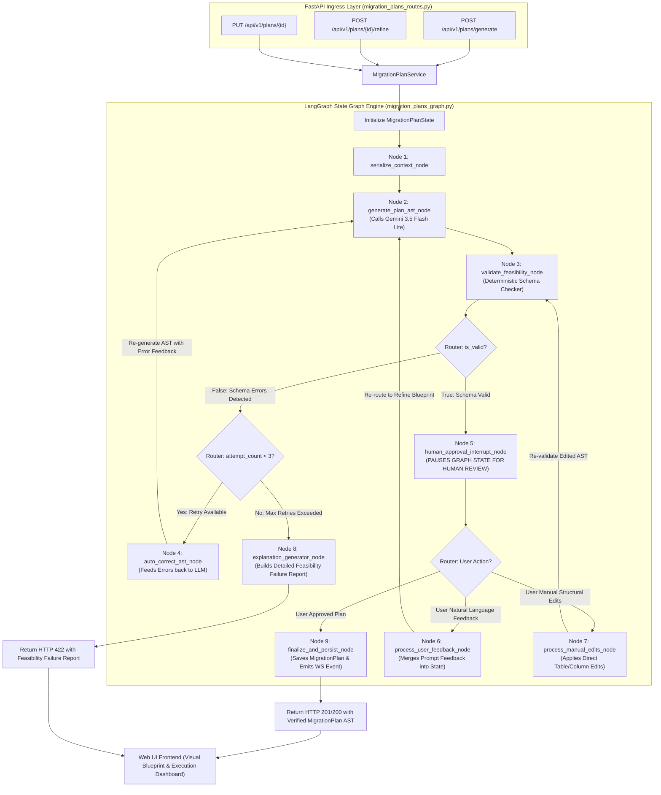

# LangGraph Stateful Agent Architecture Guide (`LANGGRAPH_ARCHITECTURE.md`)

This document provides a comprehensive architectural and educational guide for the **LangGraph Stateful Agent Plan Refinement & Feasibility Validation Engine** powering Phase 5 of the **AI Data Migration Platform**.

---

## 📐 1. System Vision & Architecture

The AI Migration Planning process is inherently **non-linear, iterative, and stateful**. A single static LLM prompt is insufficient because:
1. **AI Output Uncertainty**: An initial LLM output might contain minor schema inaccuracies (e.g. referencing a column name that doesn't exist).
2. **Human-in-the-Loop Feedback**: Database administrators must be able to inspect blueprints, rename target tables, adjust column mappings, or provide natural language instructions (*"drop password_hash and use left_join for db_2"*).
3. **Feasibility Validation**: If a user's proposed mapping is technically impossible (e.g. mapping incompatible data types without conversion rules), the system must **detect the impossibility and explain clearly WHY the database cannot be migrated with those settings**.

To solve these requirements, we use **LangGraph** (`langgraph`) to model plan generation, deterministic schema checking, auto-correction loops, human interrupts, and plan refinement as an explicit **State Graph** (`StateGraph`).

---

## 📊 2. Comprehensive LangGraph State Graph Diagram



---

## 🧠 3. Step-by-Step Node & Router Breakdown

### `MigrationPlanState` (Central Graph State)

The `MigrationPlanState` dictionary is the single source of truth passed across all nodes during the graph execution:

```python
class MigrationPlanState(TypedDict):
    agent_id: str
    target_db_type: str
    custom_instructions: Optional[str]
    context_yaml: str
    snapshots: List[Any]
    current_ast: Optional[Dict[str, Any]]
    validation_result: Optional[Dict[str, Any]]
    user_feedback: Optional[str]
    manual_edits: Optional[Dict[str, Any]]
    attempt_count: int
    is_approved: bool
    feasibility_explanation: Optional[str]
```

---

### Node-by-Node Responsibilities

#### **Node 1: `serialize_context_node`**
- **Role**: Takes the agent's attached data source `MetadataSnapshot` trees and runs `MetadataContextSerializer.serialize()`.
- **Output**: Produces a sanitized, Zero-Raw-Data YAML context string containing table structures, data types, column ordinal positions, primary keys, and foreign keys.

#### **Node 2: `generate_plan_ast_node`**
- **Role**: Invokes Google Gemini 3.5 Flash Lite via `ChatGoogleGenerativeAI`.
- **Functionality**:
  - On **initial run**: Generates a complete `TransformationPlanAST` (target DDL SQL, table mappings, column type casts, deduplication rules).
  - On **refinement run**: Receives previous AST + natural language user feedback and generates a refined AST blueprint.
- **Output**: Sets `state["current_ast"]`.

#### **Node 3: `validate_feasibility_node`**
- **Role**: Executes the **Deterministic Schema Validator** (`MigrationPlanValidator`).
- **Functionality**:
  1. Checks if every source table referenced in mappings exists in metadata snapshots.
  2. Checks if mapped source columns exist in source tables.
  3. Checks data type casting feasibility (flags impossible direct casts like `text` $\rightarrow$ `integer` without conversion rules).
  4. Checks primary key and deduplication column validity.
  5. Checks foreign key target table references.
- **Output**: Sets `state["validation_result"]` with `is_valid: bool`, `errors: List[str]`, `warnings: List[str]`.

#### **Router 1: `check_validation_router` (Conditional Edge)**
- Inspects `state["validation_result"]["is_valid"]`:
  - If `True` $\rightarrow$ Routes to **Node 5 (`human_approval_interrupt_node`)**.
  - If `False` $\rightarrow$ Routes to **Retry Router**.

#### **Node 4: `auto_correct_ast_node`**
- **Role**: **Self-Correction Loop**.
- **Functionality**: Takes the specific validation errors generated by Node 3, formats them into a corrective prompt, increments `attempt_count`, and feeds them back into Node 2 so Gemini can fix the AST before presenting it to the user.

#### **Node 5: `human_approval_interrupt_node`**
- **Role**: **Human-in-the-Loop Pause Point**.
- **Functionality**: Uses LangGraph's native `interrupt()` capability to **pause execution state**.
- **State Behavior**: The graph serializes its state to PostgreSQL memory checkpointer. The API returns the valid AST blueprint to the Web UI for human review.

#### **Router 2: `human_feedback_router` (Conditional Edge)**
- When the user interacts with the Web UI:
  - If user clicks **"Approve & Start Migration"** $\rightarrow$ Routes to **Node 9 (`finalize_and_persist_node`)**.
  - If user types natural language feedback (*"rename table to customer_accounts"*) $\rightarrow$ Routes to **Node 6 (`process_user_feedback_node`)**.
  - If user manually edits table/column mappings in UI $\rightarrow$ Routes to **Node 7 (`process_manual_edits_node`)**.

#### **Node 6: `process_user_feedback_node`**
- **Role**: Merges natural language prompt feedback into `state["user_feedback"]` and re-routes back to **Node 2 (`generate_plan_ast_node`)** for Gemini re-generation.

#### **Node 7: `process_manual_edits_node`**
- **Role**: Directly applies user's manual UI modifications (renaming table/file names, dropping column mappings, changing data types) to `state["current_ast"]` and re-routes to **Node 3 (`validate_feasibility_node`)** for instant schema validation.

#### **Node 8: `explanation_generator_node`**
- **Role**: **Feasibility Failure Reporter**.
- **Functionality**: When a user's proposed plan or edit is technically impossible and cannot be auto-corrected after 3 attempts, this node constructs a human-readable diagnostic explanation detailing **why the database cannot be migrated with those settings**.

#### **Node 9: `finalize_and_persist_node`**
- **Role**: Saves the verified, human-approved `MigrationPlan` ORM entity to PostgreSQL DB, sets `status = 'completed'` or `'approved'`, and broadcasts WebSocket event `PLAN_GENERATED`.

---

## ⚡ 4. Key Architectural Takeaways for Learning LangGraph

1. **State Centralization**: Everything flows through `MigrationPlanState`. Nodes are simple Python functions that read state and return modified keys.
2. **Determinism + AI Synergy**: Deterministic Python code (`MigrationPlanValidator`) acts as a guardrail around the non-deterministic LLM (`Gemini`).
3. **No Code Sprawling**: Complex loop logic, retries, and human pause points are declared cleanly using LangGraph's `add_node()`, `add_edge()`, and `add_conditional_edges()`.
4. **Stateful Persistence**: LangGraph's checkpointer persists state across separate HTTP API calls, enabling seamless Human-in-the-Loop workflows.
